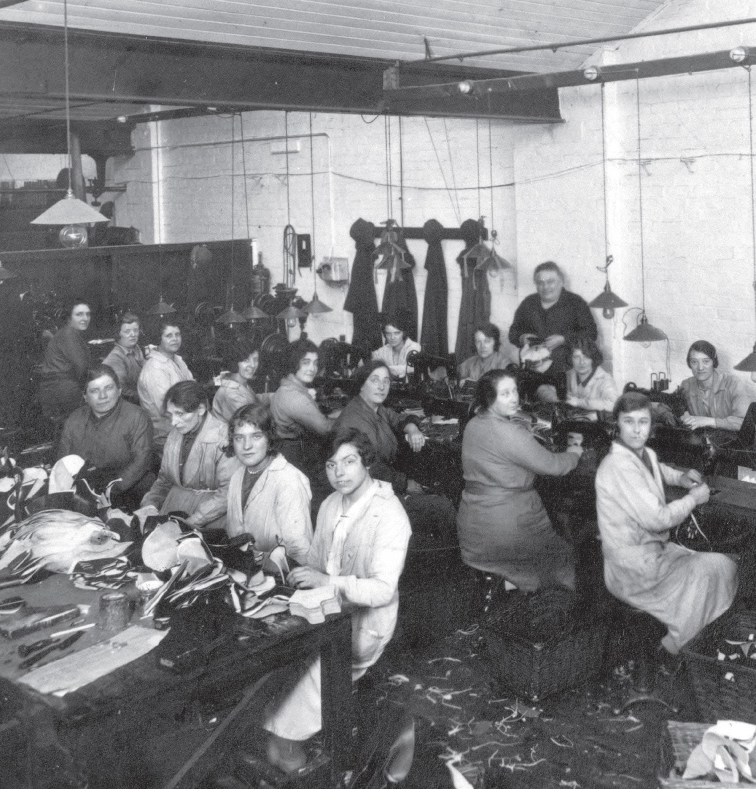

# Derechos laborales 

## Ejercicio integrador

**Estamos en algún país donde no sólo aún hay fábricas que funcionan, sino donde los obreros van mejorando paulatinamente su situación laboral, pero como simpre, a partir de hacerse oír.**

De los obreros conocemos una serie de tareas que hacen en su trabajo, su instrumental de seguridad, su sueldo y si están en blanco o no.

Cuando un obrero va a hablar con un gerente de seguridad de la fábrica, si entre las tareas que realiza hay alguna de las que preocupan al gerente, su instrumental de seguridad mejora, en caso contrario continua como estaba. Por ejemplo, las tarea que le preocupan son: "pulir", "soldar" y "fundir".

También está el gerente administrativo. Cuando un obrero va a verlo, en caso que entre sus tareas esté la de "hacer mandados", se le mejora el sueldo.

Otro de los gerentes es el de personal. Su ocupación es poner en blanco a quienes realizan alguna tarea imprescindible. (Se conoce una lista con todas las tareas que se consideran imprescindibles)

Importante:
* El sueldo puede considerarse que es un número, y que la mejora es un porcentaje.
* El instrumental de seguridad puede ser:
  *  Ninguno. La mejora consiste en lograr una seguridad básica.
  *  Basico. (se conoce un nivel de resistencia numérico). La mejora consiste en duplicar su nivel de resistencia si dicho nivel es bajo, o pasar a tener instrumental reforzado si es alto, manteniendo el nivel de resistencia básico e inicialmente con un refuerzo nulo.
  *  Reforzado (se conoce el nivel de resistencia más el valor de refuerzo). La mejora consiste en que el valor del refuerzo aumenta, sumándosele el nivel de resistencia básico.
* Las tareas son simplemente una descripción de lo que realiza un obrero.

### Los requerimientos a resolver son:

**Hacer las siguientes funciones**
1. *reclamoIndividual* por la cual un obrero va a hablar a la oficina de un gerente, y puede volver cambiado, de acuerdo a lo explicado.
2. *reunion*. Se trata de que muchos obreros van a ver juntos al gerente. A todos los que asisten, se le producen dos veces los efectos propios de un reclamo individual al gerente, simpre en caso que verifique los requisitos.
3. *tomaDeLaFabrica* En ocasiones, se realizan medidas de fuerza en los que participan muchos obreros y se dirigen a varios gerentes a la vez. A todos los que participan de la toma que estén en blanco, se le producen sucesivamente las mejoras de todos los gerentes presentes, en caso que cumplan con sus repectivos requisitos. Obtener como queda el conjunto de obreros que tomaron la fábrica estando en blanco.

Crear un nuevo gerente de manera que sea compatible con todo lo anterior. (Al momente de definir cómo mejora la situación laboral y según qué condición, evitar complicarse con algo muy sofisticado como también1 no caer en una trivialidad) 

**Mostrar ejemplos de consulta** de las funciones anteriores, para lo cual se deben crear datos de ejemplo.

**Justificar conceptualmente:**
* ¿Que sucede en la toma de la fábrica si la lista de obreros es infinita? ¿Y si fueran infinitos gerentes?
* Mostrar un caso donde la composición de funciones haya sido de utilidad y explicar por qué.
